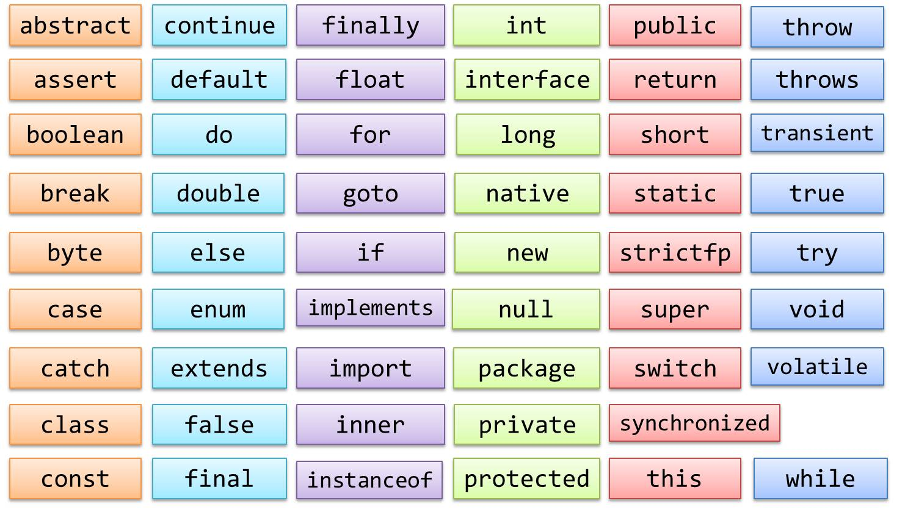
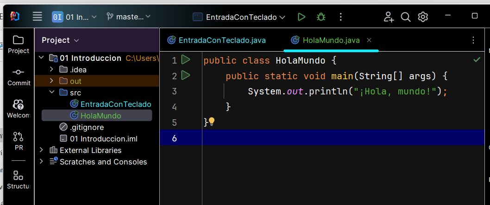

<h1>Algo de código para empezar</h1>

````java
/* Primer programa escrito en Java
  */
  public class HelloWorld {
     public static void main(String args[]) {
          System.out.println("Hello students!");
     }
  }
  ````
- Los comentarios se escriben entre los caracteres /* y */ y pueden ocupar varias líneas
- Si un comentario sólo ocupa una línea se puede escribir justo después de los caracteres //
- La instrucción System.out.println(“Hello Students”) escribe el texto indicado por pantalla
- Cada sentencia de código se termina siempre con un ;
- La definiciones de las clases y métodos no se consideran sentencias y no terminan con el caracter ; ya que definen nuevos bloques de código
- Cada bloque de código se inicia con el caracter { y termina con }

<h1>Palabras reservadas</h1>

<a href="https://docs.oracle.com/javase/tutorial/java/nutsandbolts/_keywords.html">Fuente: Oracle Java Docuentation</a>

<h1>Proceso de desarrollo de una aplicación Java</h1>

<h2>Algunas consideraciones</h2>

- Normalmente una aplicación se corresponde con un Proyecto (en IntelliJ IDEA en nuestro caso)
- Estructura basada en paquetes (carpetas) y debemos especificar uno como mínimo
- La unidad mínima de un proyecto es la clase (normalmente pública) y normalmente cada una se escribe en un fichero de código
- La unidad mínima de ejecución es el método que normalmente estará compuesto de un conjunto de instrucciones relacionadas
- **Como mínimo tendrá que haber una clase pública con el método public static void main(String args[])**, que será el punto de arranque cuando se ejecute el proyecto
- El compilador nunca procesa los comentarios
- Nunca debemos editar/modificar los ficheros del proyecto que no sean código Java


<h1>Estructura de un proyecto Java</h1>


<h2>Proceso de creación de una aplicación</h2>
- Al compilar, cada clase de código genera un fichero .class y sólo una de ellas será la que inicie la aplicación
- No es raro que un proyecto pueda contener más de 100 clases, a lo que habría que sumar otros recursos (texto, imágenes, . . .)

<h1>Los comentarios</h1>
Los comentarios permiten añadir texto al programa que no será procesado por el compilador, por lo que no forma parte del programa. Se utiliza para que el programador pueda añadir notas al código que le permitan dejar explicaciones de algoritmos complicados o de partes del código que deban ser interpretadas en el futuro por él mismo u otro programador.

También se pueden utilizar para lo que se conoce como comentar el código. En ocasiones, no estamos seguros de cómo funcionará una alternativa a un código que ya tenemos escrito. Podemos meter entre comentarios el fragmento que ya tenemos y probar la alternativa sin necesidad de eliminarlo. Hay que tener en cuenta que, posteriormente, podemos descubrir que el código tal y como lo teníamos era correcto o que el fallo era algo menor y sólo hacía falta hacer algún pequeño cambio, no reemplazar todo ese fragmento de código.

Podemos eliminar las marcas de comentario y volver a dejar el código inicial sin mucha complicación.

Los comentarios que ocupan una línea se preceden de los caracteres // y son válidos a partir de dichos caracteres, pudiéndose escribir a la derecha de una línea de código que sí deba ser procesada.

Si queremos escribir varias líneas como comentario, podemos iniciar el bloque con los caracteres /* y terminarlos con */ sin necesidad de añadir ningún caracter adicional para cada una de las líneas.
````java
int x = 10;
// Esto es un comentario y no se ejecuta
x = x + 10;

/* Este comentario
será de varias
líneas
*/
x = 100;

/* Esto es un comentario
* de varias lineas
* que tampoco se ejecuta
* y se ve mejor que el anterior
  */
  System.out.println(x);  // Esto también sirve como comentario
````  
  <h1>Las variables</h1>
  Una variable es una porción de memoria a la que se le asigna un nombre (identificador) y es capaz de almacenar un valor que podrá ser utilizado a lo largo del programa (siempre dependiendo de los modificadores y el contexto del mismo). Además, su valor puede ser modificado en cualquier momento para que pueda ser incrementada, decrementado o simplemente reutilizada.

Hay una serie de restricciones a la hora de elegir un nombre para una variable. Fuera de esas restricciones se puede escoger cualquier combinación de caracteres válidos, pero se recomienda siempre elegir un identificador que describa el valor o el uso que se hará de dicha variable:

- No puede comenzar por ningún digito
- Puede contener cualquier letra o digito
- No puede contener ningún caracter especial (signos de puntuación, . . .) a excepción de los caracteres _ y $
- No puede contener espacios
- A continuación se muestran algunos identificadores válidos en Java:
````
fechaNacimiento 
color 
ciudad_nacimiento 
_nombre 
DireccionPostal
cantidadproducto 
cadena$Texto
````
<h2>Nombres de las variables</h2>
Además, Java dispone de una guía de estilo que define algunas recomendaciones que se pueden unir a estos requisitos, de forma que facilite la lectura Java con la idea de hacer el código de una aplicación más mantenible y reutilizable:

- Los identificadores de variable deberán comenzar siempre es minúsculas
- Si un identificador está compuesto de más de una palabra, a partir de la segunda comenzarán en mayúscula y se escribian una seguida de otra

Así, siguiendo las recomendaciones, los anteriores identificadores (todos ya válidos) deberíamos escribirlos de la siguiente forma:
````
fechaNacimiento 
color 
ciudadNacimiento 
nombre 
direccionPostal
cantidadProducto 
cadenaTexto
````
<h2>Tipos de variables</h2>
Además del nombre que tendrá la variable, tenemos que decidir el tipo, que vendrá determinado por el valor o rango de valores que pueda almacenar. En Java existen una serie de tipos de datos y los más usados son:

- **byte** Permite almacenar números enteros (positivos y negativos) (8 bits)
- **short** Permite almacenar números enteros (positivos y negativos) (16 bits)
- **int** Permite almacenar números enteros (positivos y negativos) (32 bits)
- **long** Permite almacenar números enteros (positivos y negativos) (64 bits)
- **float** Permite almacenar números de coma flotante
- **double** Permite almacenar números de coma flotante de doble precisión
- **boolean** Permite almacenar valores booleanos (true/false )
- **String** Permite almacenar cadenas de texto de longitud variable (cualquier caracter)
- **char** Permite almacenar un solo caracter

Figure 3: Tipos de datos primitivos en Java
En el programa, cuando se quiere hacer uso de una variable, se debe escribir el tipo de datos separado del nombre por un espacio. Por ejemplo, para declarar una variable de los tipos que hemos visto anteriormente sería como sigue:
````java
int numeroEntero;
long numeroEnteroLargo;
float numeroDecimal;
double numeroDecimalDoblePrecision;
boolean valorBooleano;
String cadenaDeTexto;
char unCaracter;
````
Aunque más adelante, durante el curso, veremos más en detalle algunos conceptos avanzados sobre las variables y sus tipos, por ahora tendremos que saber que **todos los tipos de datos vistos en esta parte, excepto String se conocen como tipos primitivos**, y almacenan simplemente el valor que se le asigna a dicha variable. Por el contrario, el tipo String permite declarar objetos y entonces la variable realmente actúa como un puntero que hace referencia a una dirección de memoria donde está almacenado el valor de ésta. De esa forma, más de una variable (declarada como objeto) podrá hacer referencia a ese mismo valor en un mismo programa (y podrá ser alterado desde cualquier de ellas, afectando a todas las demás).

<h1>Valores literales</h1>
Al disponer Java de varios tipos de datos para representar los números y cadenas de caracteres, nos podemos encontrar con casos en los que un mismo valor pudiera ser válido para varios de los tipos de datos existentes. Para evitar ambigüedades, Java asume un tipo de dato por defecto en caso de que nada indique lo contrario para algunos de los tipos de datos numéricos y entre números y cadenas.

- Cualquier valor que esté encerrado entre los caracteres comillas dobles “ y ” será interpretado como una cadena de caracteres
````java
int numero = "10";      // error, "10" es una cadena de texto
String numero = "10";   // correcto
````
- Cualquier valor que esté encerrado entre los caracteres comillas simples ' y ' será interpretado como una valor de tipo char .
````java
int numero = '1';       // error, '1' es un caracter
char caracter = 'c';    // correcto
````
- Cualquier valor que no esté encerrado entre ningún tipo de caracter será interpretado como un valor numérico
````java
String cadena = 10;     // error, 10 es un número
int numero = 20;        // correcto
````
- Por defecto, cualquier número entero será interpretado como entero (int ), aunque Java permite que sean asignados a variables de tipos más cortos (menor longitud en bits)
- Si se quiere representar un valor literal de tipo <code>long</code> se debe acompañar con el caracter l a la derecha del valor
````java
int numero = 50l;               // error, es un valor long
long numeroLargo = 1234567890l; // correcto
long numeroLargo = 1234567890;  // también es correcto
````
- Por defecto, cualquier número de coma flotante será interpretado como de doble precisión (double)
````java
float peso = 10.4;      // error, pérdida de precisión
double peso = 10.4;     // correcto
````
- Si se quiere representar un valor literal de tipo <code>float</code> se debe acompañar con el carácter f a la derecha del valor
````java
float altura = 1.80f;   // correcto
````
<h1>Valores por defecto</h1>
Hay que tener en cuenta que las variables, en el momento de declararlas, tendrán un valor por defecto:

- Todos los valores numéricos tomarán el valor 0 como valor por defecto
- Las variable booleanas tomarán el valor false como valor por defecto
- El tipo <code>char</code> guarda el valor null (nulo)
- Los tipos no primitivos como <code>String</code> no tienen valor por defecto (lo que se conoce como <code>null</code>)
<h1>Alcance de las variables</h1>
El alcance de las variables se refiere al ámbito en que éstas pueden ser utilizadas. Como regla general hay que considerar que una variable podrá ser utilizado sólo dentro del bloque de código donde ha sido declarada. Más adelante, a medida que avance el curso, iremos viendo diferentes conceptos de bloque de código o diferentes tipos de ámbito con los que podremos encontrarnos. Por ahora, vamos a suponer que las variables las podremos utilizar a partir de donde han sido declaradas, y nunca antes de hacerlo.

Además, hay que tener en cuenta que, por norma general, las variables se declaran siempre al inicio del bloque donde van a usarse por primera vez. En este primer módulo las declararemos al inicio del método main para poder usarlas a lo largo de todos los ejemplos de programas que hagamos.

Nivel de acceso de las variables
Por ahora, mientras nos conozcamos los detalles del paradigma de Programación Orientada a Objetos, vamos a hablar de variables globales y locales para explicar el alcance de éstas.

Las variables globales son aquellas que se declaran al inicio del programa y perduran durante toda su ejecución. Pueden ser utilzadas desde cualquier parte del mismo
Las variables locales son aquellas que se declaran en algún bloque del programa y perduran solamente dentro de ese bloque. Podrán ser, por tanto, utilizadas solamente dentro del bloque donde fueron declaradas
Conversión de tipos
Como hemos visto, a la hora de declarar una variable, tenemos que decidir qué tipo de dato almacenará y asignarle el que corresponda. Eso permite un mayor control de errores para evitar asignaciones de valores incorrectos pero también añade cierta dificultad cuando tenemos, por ejemplo, un número almacenado en una variable de tipo cadena y queremos sumarle otra cantidad que, por ejemplo, tenemos almacenada como número entero (Ten en cuenta que en las aplicaciones gráficas, las cajas de texto normalmente siempre almacenan el contenido como cadena de texto, por lo que el caso aqui expuesto es muy habitual).

Con todo esto, por norma general, siempre podremos convertir el valor de una variable a otra variable de distinto tipo, siempre y cuando tenga sentido representar dicho valor como otro tipo de dato. Por ejemplo, el dígito 1 puede ser interpretado como el número 1 pero también se podría interpretar como el caracter '1' y como la cadena de texto “1” .

Conversión implícita
Algunas conversiones resulta bastante triviales y las hará Java por nosotros. Es lo que se conoce como una conversión ímplicita, ya que no requiere ninguna codificación extra por parte del programador y no suponga ninguna pérdida en el valor. Veamos un ejemplo donde un valor entero se convierte de forma implícita a un tipo entero:

int numero = 3;
float otroNumero = numero;
System.out.println(otroNumero);     // 3.0
Y a continuación podemos ver otro ejemplo donde el compilador nos mostraría un error al no admitir una conversión implícita cuando ésta conlleve perdida de valor:

float numero = 3.45f;
int otroNumero = numero;    // error: incompatible types: possible lossy conversion . . .
System.out.println(otroNumero);     
Conversión explícita
Para poder llevar a cabo por el momento una conversión explícita de tipos sencilla, podemos interponer el tipo de dato al que queramos convertir el valor (encerrado entre paréntesis). Aunque hay que tener en cuenta que esto sólo se podrá hacer entre tipos de datos compatibles (String no lo es con ninguno de los tipos numéricos). Por ejemplo:

float numero = 3.45f;
int otroNumero = (int) numero;
System.out.println(otroNumero);     // 3
Para convertir cualquier valor a un tipo String podemos utilizar el método String.valueOf(valor) . Por ejemplo:

float numero = 3.45f;
String cadena = String.valueOf(numero);
System.out.println(cadena);         // 3.45
Y para convertir un valor de cadena a los demás tipos de datos, podemos utilizar los métodos de los respectivos tipos de datos de clase que existen para cada tipo de dato primitivo, siempre y cuando el valor que contiene la cadena de texto pueda ser convertido como el valor del nuevo tipo de dato. Por ejemplo: Integer, Float, y Boolean son algunos de ellos. Veamos un ejemplo para cada uno de ellos:

String cadena = "1234";
int numero = Integer.parseInt(cadena);  // correcto
String otraCadena = "hola";
int otroNumero = Integer.parseInt(otraCadena);  // error
String cadena = "1234";
float numero = Float.parseFloat(cadena);  // correcto
String otraCadena = "1234f";
float otroNumero = Float.parseFloat(otraCadena);  // correcto
String cadena = "true";
boolean valorBooleano = Boolean.parseBoolean(cadena);   // correcto
String otraCadena = "hola";
boolean otroValorBooleano = Boolean.parseBoolean(otraCadena);   // correcto (será false)
Las constantes
Las constantes son estructuras que se definen con un valor fijo que no se puede modificar. Se utilizan para evitar tener que escribir números literales a lo largo del código, cuyos valores pueden cambiar en un futuro. De esa manera, colocaremos el nombre de la constante que defina dicho valor y en el momento en que ésta cambie, sólo tendremos que cambiar el valor en el lugar donde fue definida.

Hay que tener en cuenta que Java recomienda utilizar una notación diferente para los identificadores de las constantes. Se recomienda utilizar sólo mayúsculas y si el nombre contiene más de una palabra, se deben de separar con el caracter subrayado _

// Constantes para uso local
final float IVA = 0.21;
final int NUMERO_PAGINAS = 10;

// Constantes para uso global
public static final float IVA = 0.21;
public static final int NUMERO_PAGINAS = 10;
Enumeraciones
Permiten definir nuevos tipos de datos con rangos de valores muy limitados
Sustituyen a las constantes para casos en los que éstas estaban relacionadas entre sí (distintos valores de un mismo rango)
Al final no dejan de ser una serie de constantes pero agrupadas entre sí y con cierto contexto añadido
Una vez definida una enumeración, es posible definir variables de ese tipo cuyos posibles valores serán aquellos que se hayan definido en la enumeración
public enum Direccion {
ARRIBA, ABAJO, DERECHA, IZQUIERDA
}
. . .
private Direccion direccion;
direccion = Direccion.ABAJO;
Definir tipos enumerados
public enum Estacion {
PRIMAVERA (10, 20.5f),
VERANO (23, 40),
OTONO (5.3f, 15),
INVIERNO (-2.1f, 10);

private final float temperaturaMinima;
private final float temperaturaMaxima;

Estacion(float minima, float maxima) {
temperaturaMinima = minima;
temperaturaMaxima = maxima;
}

public float temperaturaMinima() {
return temperaturaMinima;
}

public float temperaturaMaxima() {
return temperaturaMaxima;
}

public float diferenciaTemperatura() {
return temperaturaMaxima - temperaturaMinima;
}
}
La librería de clases de Java
Clase Object
Es la clase de la que todas las demás clases heredan automáticamente. De esa manera adquieren sus atributos y métodos. Por eso motivo, cualquier objeto Java contiene siempre una estructura mínima y común para todos.

Los métodos de esta clase con los que es más habitual trabajar son los siguientes:

equals(Object object): Permite comparar dos objetos cualquiera
hashCode(): Permite conocer el hash de un objeto para determinar si es el mismo que otro (útil para algunas colecciones, por ejemplo)
toString(): Permite representar, automáticamente, cualquier objeto como una cadena de texto cuando sea necesario
Lo habitual es, una vez creada la clase (y por tanto heredados), modificarlos para adaptarlos al comportamiento específico de cada clase (lo veremos más adelante en el tema de Programación Orientada a Objetos).

public class Student {
private String studentId;
private String name;
private String lastName;
.....
// TODO getters y setters
. . .
@Override
public int hashCode() {
return studentId.hashCode();
}

@Override
public boolean equals(Object object) {
if (object == null) return false;
if (!(object instanceof Student) return false;

    Student student = (Student) object;
    if (student.geStudentId() != studentId)
      return false; 
    }
    return true;
}

@Override
public String toString() {
return studentId + (" + name + " " + lastName + ")";
}
}
Clases String y StringBuilder
String: Clase que permite representar una cadena que no puede ser modificada (es inmutable)
String nombre = "Code";
nombre += "AndCoke"; // Se vuelve a crear un String con el resultado de concatenar ambas System.out.println(nombre);
StringBuilder: Clase que permite representar cadenas como String pero, al contrario que éstas, puede ser modificado
StringBuilder nombre = "Code"; nombre.append("AndCoke"); // Es el mismo objeto System.out.println(nombre.toString());
Clases Wrapper
Existe una clase wrapper para cada tipo primitivo

Long, Integer, Byte, Short, Double, Float, Character, Boolean
Permiten evitar tener que usar los tipos primitivos
Contiene métodos de utilidad para el tipo de dato que representan
Clases para realizar cálculos con precisión exacta (no coma flotante)
BigDecimal, BigInteger
Operación en coma flotante (por defecto, más rápida)

double numero1 = 0.08374;
double numero2 = 0.3434;
double resultado = numero1 + numero2; System.out.println(resultado);
Operación con precisión exacta (más costosa en tiempo)

BigDecimal nota = new BigDecimal("0.08374");
BigDecimal otra = new BigDecimal("0.3434");
BigDecimal mas = nota.add(otra);
System.out.println(mas);
Clase Math
Clase con métodos estáticos para realizar todo tipo de operaciones matemáticas

abs(numero): Valor absoluto de un número (útil para calcular la diferencia o distancia entre dos valores)
ceil(numero): Obtiene el siguiente valor entero por encima del que se pasa como parámetro
floor(numero): Obtiene el anterior valor entero por debajo del que se pasa como parámetro
max(numero1, numero2): Obtiene el máximo de dos valores dados
min(numero1, numero2): Obtiene el mínimo de dos valores dados
random(): Devuelve un número aleatorio entre 0 y 1
round(numero): Redondea el número que se pasa como parámetro
sqrt(numero): Calcula la raíz cuadrada del número que se pasa como parámetro
Scanner
Clase que permite leer una entrada de datos, por ejemplo, la entrada por teclado para almacenar en una variable lo que el usuario escribe:

Scanner keyboard = new Scanner(System.in);
String input = keyboard.nextLine();
String integerNumber = keyboard.nextInt();
Clase Random
Clase que permite generar valores pseudoaleatorios algo más cómodos que los generados con Math.random() (números enteros, números enteros entre un rango dado, valores booleanos, . . . )

Random generator = new Random();
int integerNumber = generator.nextInt(10);
boolean booleanValue = generator.nextBoolean();
Code snippets
Mostrar un mensaje en pantalla
System.out.println("Hola que tal");
. . .
int cantidad = 10;
System.out.println("La cantidad es " + cantidad);
Generar un número aleatorio entre 0 y 10
Random generador = new Random();
int numeroAleatorio = generador.nextInt(10);
Simular el lanzamiento de una moneda
Random generador = new Random();
boolean lanzamientoMoneda = generador.nextBoolean();
Leer la entrada del usuario por teclado
Scanner teclado = new Scanner(System.in);
String entrada = teclado.nextLine();
Reproducir un fichero de audio
try {
File f = new File("sample.wav");
AudioInputStream audioIn = AudioSystem.getAudioInputStream(f.toURI().toURL());
Clip clip = AudioSystem.getClip();
clip.open(audioIn);
clip.start();
} catch (IOException | UnsupportedAudioFileException | LineUnavailableException ioe) {
ioe.printStackTrace();
}
Ejercicios


Haz un programa que solicite dos números y diga si son o no iguales
Realiza un programa que solicite un número y diga si es positivo o negativo
Realiza un programa que solicite tres números y los pinte en la pantalla ordenados de menor a mayor. Si el usuario introduce el 10, el 20 y el 2, el programa mostrará: “2 10 20”
Realiza un programa que solicite un número entre 1 y 1000 e indique cuántos dígitos tiene
Haz un programa que calcule el área de diferentes forma geométricas. Puedes hacer un menú donde el usuario pueda escoger entre algunas de ellas (cuadrado, rectángulo, círculo, triángulo, . . .). El programa deberá pedir también las medidas necesarias y, finalmente, mostrará el área de la figura.
Realiza un programa donde el usuario tenga que introducir 3 números y el programa calcule cuál de ellos es el mayor de todos. Lo mostrará por pantalla.
Realiza un programa que permite introducir al usuario una hora (formato 12 o 24 horas, hora, minuto y segundo por separado) y compruebe que es correcto cada uno de los datos que éste introduzca. En caso de fallo hará que el usuario vuelva a introducir el dato erróneo.
Realiza una aplicación que solicite por pantalla 3 números y los guarde en una cadena de texto separados por un espacio. Por ejemplo, si el usuario introduce el 2, el 13 y el 235, el programa los almacena como “2 13 235” y lo pinta en la pantalla.
Realiza un programa que comience solicitando al usuario dos números cualesquiera. El programa tendrá que mostrar por pantalla la secuencia completa de números enteros que vayan desde el número menor al mayor de los introducidos. Por ejemplo, si el usuario introduce los números 20 y 12 el programa hará aparecer la siguiente secuencia (uno por línea): 12, 13, 14, 15, 16, 17, 18, 19, 20.
Realiza un programa que comience solicitando al usuario dos números cualesquiera. A continuación, tendrá que mostrar, de forma similar al ejercicio anterior, la secuencia de números entre los que ha introducido el usuario, pero sólo mostrará los pares. Por ejemplo, si el usuario introduce el 10 y el 20, el programa hará aparecer la siguiente secuencia por pantalla: 10, 12, 14, 16, 18, 20
Realiza un programa como el anterior pero será el usuario quién decida si de la secuencia final de números que se deben mostrar, lo harán los pares o los impares. Esa información se la solicitará el programa tras pedirle los dos números iniciales.
Realiza una aplicación que funcione como conversor de monedas entre dos divisas (dólar y euro). Al iniciar la aplicación se presentarán al usuario las dos opciones (pasar de dólares a euros y viceversa) y el usuario tendrá que seleccionar una de las dos. A continuación, se le solicitará la cantidad, que deberá introducir. Para finalizar, el programa mostrará, al usuario por pantalla, la cantidad convertida a la divisa que procesa en cada caso.
Realiza un programa que solicite al usuario un número cualquiera y le indique al usuario si el número introducido es par o impar. El programa solicitará siempre un nuevo número hasta que el usuario decida salir (puedes crear un menú o bien seleccionar un texto que sirva como forma de indicar que se desea salir).
Realiza un programa donde el ordenador se piense un número y el usuario tenga un número límite de intentos para adivinarlo. El programa permitirá al usuario fijar ese número límite de intentos y por cada uno de ellos dará una pista indicando si el número que se ha pensado es mayor o menor que el introducido. Una vez que el usuario adivine el número o bien gaste el número de intentos se terminará el programa. En caso de que el usuario pierda se mostrará el número pensado por el ordenador. (Justo antes de los ejercicios puedes consultar cómo generar un número aleatorio y guardarlo en una variable).
© 2019-2024 Santiago Faci

apuntes/introduccion.txt · Last modified: 2023/10/22 12:28 by Santiago Faci
Page Tools
Except where otherwise noted, content on this wiki is licensed under the following license: CC Attribution-Noncommercial-Share Alike 4.0 International
CC Attribution-Noncommercial-Share Alike 4.0 International Donate Powered by PHP Valid HTML5 Valid CSS Driven by DokuWiki
