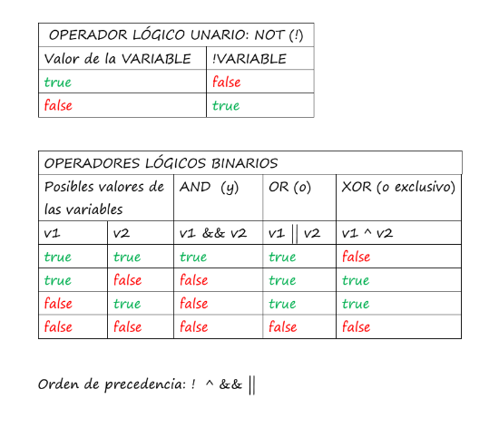

## **Los operadores unarios**

Los operadores unarios actúan sobre una sola variable:

- Operador <code>++</code>: añade una unidad a la variable a la que se aplica. Actúa como preincremento o posincremento, dependiendo de si se coloca a la izquierda o derecha de la variable, respectivamente.

Ejemplo de preincremeno: 
```java
int x = 10;
System.out.println(++x);// 11 Primero incrementa y luego imprime.
System.out.println(x++);// 11 Primero imprime y luego incrementa
System.out.println(x);// 12
```

- Operador <code>--</code>: disminuye en una unidad la variable a la que se aplica. Al igual que ocurre con el anterior operador, puede ser utilizado como operador de predecremento posdecremento, dependiendo de si se coloca a la izquierda o derecha de la variable, respectivamente

```java
int x = 10;
System.out.println(--x);// 9 Primero decrementa y luego imprime
System.out.println(x--);// 9 Primero imprime y luego decrementa
System.out.println(x);// 8
```

- Operador <code>!</code>: Permite “negar” el valor de la variable. Si la variable que lo acompaña es de tipo booleano, devolverá el valor contrario (<code>true</code> si la variable es <code>false</code>, y viceversa)

```java
boolean terminado =false;
System.out.println(!terminado);// true
```

- Operador <code>-</code>: además de para restar, se utiliza para indicar que un valor numérico es negativo.

```java
int x = -100;
int y = 500;
int z = -y;
System.out.println(x);// -100
System.out.println(y);// 500
System.out.println(z);// -500
System.out.println(-x);// 100
System.out.println(-y);// -500
System.out.println(-z); // 500
```

## **Los operadores aritméticos**

Los operadores aritméticos permiten realizar operaciones aritméticos entre dos o más variable o expresiones:

- Operador sumaa <code>+</code>: Permite sumar dos expresiones

```java
int valor = 3 + 3;
int a = 3;
int b = 5;
int suma = a + b; // suma = 8
```

- Operador resta <code>-z</code>: Permite restar dos expresiones

```java
int valor = 3 - 6; // valor = -3
```

- Operador producto <code>*</code>: Permite multiplicar dos expresiones

```java
float peso = miPeso * 10f;
```

- Operador división <code>/</code>: Permite dividir dos expresiones

**OJO 👁️**: dependiendo de cómo sean los valores que divide la división será entera o con decimales
```java
      System.out.println(13 / 5); // 2
      System.out.println(13.0 / 5); // 2.6
```

- Operador módulo <code>%</code>: Permite obtener el módulo entre dos expresiones, que es el resto de la división entre dos números enteros

```java
int modulo = 5 % 2; // 1
```

## **Los operadores de asignación**

Los operadores de asignación permite asignar el resultado de una operación o valor a una variable, o que dicho valor sea utilizado como operando de otra operación o expresión. Además, existen algunos operadores que combinan operaciones aritméticas y permiten asignar al mismo tiempo el resultado de dicha operación.

- Operador de asignación <code>=</code>: Asigna al operando de la izquierda el valor del resultado de la expresión de la derecha

```java
int x = 2; // guarda el valor 2 en la variable x
System.out.println(x);// 2
int y;
y = x * 10; // guarda el resultado de multilicar x por 2 en la variable y
System.out.println(y);// 20
```

- Operador de asignación suma <code>+=</code>: Incrementa la variable del lado izquierdo el valor de la expresión del lado derecho, y le asigna el resultado

```java
int x = 10;
x += 2; // es lo mismo que x = x + 2, es decir, suma x más 2 y el nuevo valor lo guarda en x, reemplazando el valor antiguo
System.out.println(x);// 12
```

- Operador de asignación resta <code>-=</code>: Decrementa la variable del lado izquierdo el valor de la expresión del lado derecho, y le asigna el resultado

```java
int x = 10;
x -= 1; // x = x - 1
System.out.println(x);// 9
x -= 10 + 2; // x = x - 10 + 2
System.out.println(x);// -3
```

- Operador de asignación multiplicación <code>*=</code>: Multiplica el valor de la variable del lado izquierdo por el valor de la expresión del lado derecho, y le asigna el resultado

```java
int x = 10;
x *= 2 + 3;
System.out.println(x);// 50;
```

- Operador de asignación división <code>/=</code>: Divide el valor de la variable del lado izquierdo por el valor de la expresión del lado derecho, y le asigna el resultado

```java
int x = 100;
x /= 8 + 2; // x = x / 2
System.out.println(x);// 10
```

- Operador de asignación módulo <code>%=</code>: Calcula el módulo de la variable con la expresión del lado derecho, y le asigna el resultado

```java
int x = 9;
x %= 3 - 1;
System.out.println(x);// 1
```

## **Los operadores relacionales o de comparación**

👉👉El resultado una expresión de comparación siempre es booleano, es decir sólo puede ser <code>true</code> o <code>false</code>.

- Operador igual que <code>==</code>: Permite comparar dos valores/expresiones

```java
System.out.println(10 == 3);// false
int x = 3;
int y = 3;
System.out.println(x == y);// true
```

- Operador distinto que <code>!=</code>

```java
System.out.println(10 != 3);// true
int x = 3;
int y = 3;
System.out.println(x != y);// false
```

- Operador mayor que <code>></code>

```java
System.out.println(10 > 3);// true
```

- Operador mayor o igual que <code>>=</code>

```java
System.out.println(3 >= 3);// true
```

- Operador menor que <code><</code>

```java
System.out.println(10 < 3);// false
```

- Operador menor o igual que <code><=</code>

```java
System.out.println(2 <= 3);// true
```

## **El operador de concatenación**

El operador de concatenación permite añadir a una cadena de texto el contenido de otra. En Java se utiliza el mismo operador que para sumar números, pero al usarse con cadenas de texto funciona como operador de concatenación.

```java
String unaCadena = "Esto es ";
String otraCadena = "una cadena";
String cadena = unaCadena + otraCadena;
System.out.println(cadena);// Esto es una cadena
```

## **Operadores lógicos**
Las variables de tipo boolean se utilizan a menudo para construir expresiones lógicas utilizando operadores lógicos. 
Java tiene cuatro operadores de este tipo (pero en la práctica sólo se usan tres de ellos=: 
- NOT (<code>!</code>): ya lo vimos antes. Es un operador unario que invierte el valor booleano. 
````java
boolean f = false; // f es falso 
boolean t = !f; // t es verdadero, true 
````
- AND (&&): Es un operador binario que significa "Y" ("esto y lo otro"). Devuelve true si ambos operandos son true; de lo contrario, es false.

````java
boolean b1 = false && false; // false 
boolean b2 = false && true; // false 
boolean b3 = true && false; // false 
boolean b4 = true && true; // true
````

- OR (||): es un operador binario que significa "O" ("o esto o lo otro"). Devuelve true si al menos un operando es true, de lo contrario, devuelve false. 

````java
boolean b1 = false || false; // false 
boolean b2 = false || true; // true 
boolean b3 = true || false; // true 
boolean b4 = true || true; // true 
````
- XOR u OR exclusivo (^): es un operador binario que devuelve true si los operandos booleanos tienen valores diferentes; de lo contrario, es false. Se puede leer como "o esto o lo otro, pero no ambos".
````java
boolean b1 = false ^ false; // false 
boolean b2 = false ^ true; // true 
boolean b3 = true ^ false; // true 
boolean b4 = true ^ true; // false 
````
El operador XOR se usa con menos frecuencia que otros. 

### **Evaluación de circuito corto**
Una cosa interesante es que con los operadores <code>&&</code> y <code>||</code> es que a veces no hace falta evaluar el segundo valor:
- Cuando el primer valor del operador <code>&&</code> es <code>false</code>, no hace falta mirar el segundo valor porque ya sabes que va a dar <code>false</code>; por tanto, <code>false && loquesea-> false</code> 
- y cuando el primer argumento del operador <code>||<code> se evalúa <code>true</code>, no hace falta mirar el segundo argumento porque ya sabes que va a dar <code>true</code>; por tanto, <code>true || loquesea -> true</code>

## Orden de precedencia de los operadores lógicos 
A continuación se muestran las operaciones lógicas ordenadas por orden de prioridad decreciente en expresiones: 
1. !(NOT) 
2. ^(XOR) 
3. &&(AND) 
4. ||(OR). 
Es decir, si aparecen conjuntamente sin paréntesis, tiene prioridad (precedencia, hay que realizar esa operación antes) <code>!</code> frente a todos los demás; lo contrario podemos decir de OR. 
Por ejemplo:
````java
boolean b = true && !false; // true, porque !false se evalúa primero 
````
Podemos cambiar este orden de ejecución cuando queramos utilizando paréntesis (lo que está dentro de paréntesis se ejecuta antes).



## Unir operaciones relacionales usando operadores lógicos 
En Java, no se puede escribir una expresión como <code>a <= b <= c</code>. En lugar de eso hay que unir dos expresiones booleanas usando operadores lógicos como <code>||</code> y <code>&&</code>. 
Por ejemplo: 
````java
num > 100 && num < 200; // significa 100 < num < 200.
````

Podemos escribir partes de la expresión entre paréntesis para mejorar la legibilidad:
````java
(number > 100) && (number < 200); 
````
Pero los paréntesis no son necesarios aquí porque los operadores relacionales tienen una prioridad más alta que los operadores lógicos. 
Otro ejemplo, más general: 
````java
int num = ... // suponemos que tiene un valor determinado 
int sup = 100, inf = 200; // límite superior e inferior de un intervalo 
boolean enRango = num > inf && num < sup; // dice si num está dentro del intervalo.
````

## Orden de precedencia de todos los operadores 
Cuando tenemos en la misma expresión paréntesis, operadores aritméticos y operadores lógicos, es normal preguntarse en qué orden debemos realizar las operaciones. 
El orden de prioridad de los elementos en la sintaxis de Java es éste: 
1. Paréntesis 
2. Incrementos y decrementos (++ y --) 
3. Operadores aritméticos (en el orden habitual: primero * y /, después + y -) 
4. Operadores relacionales (>, >=, ==, etc.) 
5. Operadores lógicos (en el orden indicado: !, ^, &&, ||)
